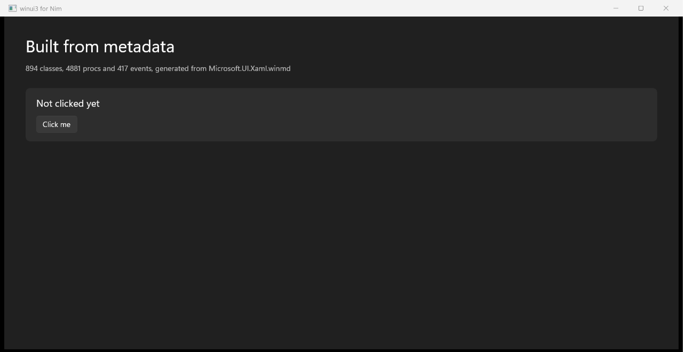

# winui3

[](https://github.com/TheSimpleZ/winui3-nim/actions/workflows/ci.yml)

Build WinUI 3 desktop apps in Nim.

No C++, no C#, no XAML files, no project templates, no bootstrapper. A Nim
program, `nim c -r`, and a native Windows 11 window.



*Mica, Fluent controls, a translucent rounded card and a working click handler
— that is `examples/generated.nim`, and there is no XAML anywhere in it.*

```nim
import winui3

start proc() =
  let window = newWindow()
  window.title = "Hello from Nim"
  window.backdrop = mica          # the material Windows 11 Settings uses
  window.content = newTextBlock("WinUI 3, from Nim")
  window.activate()
```

The whole of `Microsoft.UI.Xaml` is here — 894 classes with their properties,
methods and events, generated from Microsoft's own metadata — so if WinUI 3 has
a control, this has it, whether or not this README mentions it.

## Install

```
nimble install https://github.com/TheSimpleZ/winui3-nim
```

Then in your own `.nimble`:

```
requires "https://github.com/TheSimpleZ/winui3-nim >= 1.6.0"
```

> The dependency names a repository rather than a package because `winui3` and
> the `winrt` package underneath it are not in the nimble directory yet. Once
> they are, this becomes `requires "winui3"`.

**Requirements**

- Windows 10 version 1809 or later, x64
- Nim 2.0 or later
- The Windows App SDK runtime, which a stock Windows 11 already has —
  see [Deployment](#deployment)

## Your first app

Put this in `hello.nim`:

```nim
import winui3

start proc() =
  let window = newWindow()
  window.title = "Counter"
  window.backdrop = mica

  let panel = newStackPanel(Orientation_Vertical, spacing = 12.0)
  panel.margin = Thickness(left: 40.0, top: 32.0, right: 40.0, bottom: 32.0)

  let label = newTextBlock("Clicked 0 times")
  label.fontSize = 28.0

  var clicks = 0
  let button = newButton("Click me")
  button.onClick proc() =
    clicks.inc
    label.text = "Clicked " & $clicks & (if clicks == 1: " time" else: " times")

  panel.add label, button
  window.content = panel
  window.activate()
```

```
nim c -r hello.nim
```

That is the whole setup. The first build takes a moment longer than you expect,
because it copies the Windows App SDK into the output directory beside your
executable; see [Deployment](#deployment) for what it puts there and why.

A few things worth naming in that program:

- **`start`** takes the callback that builds your UI, runs the message loop,
  and returns when the app exits. Everything XAML must happen inside it —
  constructing a control earlier fails with `RPC_E_WRONG_THREAD`. Call
  `exitApp()` to end it.
- **`window.backdrop = mica`** is what makes the window look like Windows 11
  rather than a grey rectangle. `acrylic` and `noBackdrop` are the alternatives.
- **The closure captures `clicks` and `label`**, and stays alive as long as the
  subscription does. You do not manage that.
- **Nothing is released by hand.** Every object is reference-counted by the
  compiler.

## Finding your way around

The API is generated from `Microsoft.UI.Xaml.winmd`, so it is Microsoft's
documentation with a mechanical renaming. Learn the six rules and any
[WinUI 3 API page](https://learn.microsoft.com/windows/windows-app-sdk/api/winrt/)
tells you what to write.

| in Microsoft's docs | in Nim |
|---|---|
| class `Microsoft.UI.Xaml.Controls.Slider` | type `Slider`, constructed by `newSlider()` |
| property `Slider.Value` | `slider.value` and `slider.value = 0.5` |
| event `ButtonBase.Click` | `button.onClick(handler)`, undone by `button.removeClick(token)` |
| method `UIElement.UpdateLayout()` | `element.updateLayout()` |
| enum member `Orientation.Vertical` | `Orientation_Vertical` |
| struct `Thickness` | `Thickness(left: 8.0, top: 8.0, right: 8.0, bottom: 8.0)` |

Inheritance is real Nim inheritance, so a `Button` is a `ButtonBase` is a
`Control` is a `FrameworkElement` is a `UIElement`, and every inherited member
resolves. `margin` is declared on `FrameworkElement` and works on anything.

When in doubt, grep the generated file — it is the authoritative list:

```
grep "proc newInfoBar" src/winui3/generated/xaml_api.nim
grep "self: ProgressRing" src/winui3/generated/xaml_api.nim
```

Two rough edges to know about:

- A handful of properties are typed `pointer`, because WinRT declares them as
  `IInspectable` — `ContentControl.Content` is the one you will hit. Pass a
  wrapper's raw pointer with `.p`: `button.content = myPanel.p`. The
  `newButton("text")` convenience does this for you.
- Attached properties (`Grid.Row`, `Canvas.Left`) and most generic collections
  are not wrapped yet. See [docs/coverage.md](docs/coverage.md).

## Events

Every WinUI event becomes an `onX` proc that returns a token, and a `removeX`
that takes one back.

```nim
import winui3

start proc() =
  let window = newWindow()
  let box = newTextBox()
  box.placeholderText = "Type here"

  let echoed = newTextBlock("")
  box.onTextChanged proc(sender: pointer, args: TextChangedEventArgs) =
    echoed.text = box.text

  let panel = newStackPanel(Orientation_Vertical, spacing = 8.0)
  panel.add box, echoed
  window.content = panel
  window.activate()
```

The generated handler always takes the sender and the typed event arguments.
For `Click` and `Loaded`, where most handlers want neither, there is a shorter
form:

```nim
import winui3

start proc() =
  let button = newButton("Press")

  # the short form
  button.onClick proc() =
    echo "pressed"

  # the full form, and unsubscribing
  let token = button.onClick(proc(sender: pointer, args: RoutedEventArgs) =
    echo "pressed again")
  button.removeClick(token)

  let window = newWindow()
  window.content = button
  window.activate()
```

An exception raised inside a handler is caught, printed to stderr and reported
as handled. It does not unwind into WinUI's C++ and it does not end your
process — one bad handler is a logged message, not a crash.

## Layout

Trees are built in code. There is no XAML parser here, so a `StackPanel` with
children is `newStackPanel()` and `add`.

```nim
import winui3

start proc() =
  let window = newWindow()
  window.title = "Layout"
  window.backdrop = mica

  let page = newStackPanel(Orientation_Vertical, spacing = 16.0)
  page.margin = Thickness(left: 40.0, top: 32.0, right: 40.0, bottom: 32.0)

  let heading = newTextBlock("A card")
  heading.fontSize = 32.0

  # A Border is the usual way to draw a card: one child, a background,
  # rounded corners and padding.
  let card = newBorder()
  card.cornerRadius = CornerRadius(topLeft: 8.0, topRight: 8.0,
                                   bottomRight: 8.0, bottomLeft: 8.0)
  card.padding = Thickness(left: 20.0, top: 16.0, right: 20.0, bottom: 16.0)

  let fill = newSolidColorBrush()
  fill.color = Color(a: 255, r: 255, g: 255, b: 255)
  fill.opacity = 0.06          # on the brush, not the element: Opacity on a
  card.background = fill       # UIElement would fade its own text too

  let body = newStackPanel(Orientation_Vertical, spacing = 12.0)
  body.add newTextBlock("Contents"), newButton("Do the thing")
  card.child = body

  page.add heading, card
  window.content = page
  window.activate()
```

The pieces you will reach for most:

| | |
|---|---|
| `newStackPanel(Orientation_Vertical, spacing = 12.0)` | children in a row or a column |
| `newGrid()` | rows and columns, with `newRowDefinition()` / `newColumnDefinition()` |
| `newBorder()` | one child, a background, a corner radius |
| `newScrollViewer()` | scrolling |
| `margin`, `padding` | `Thickness(left:, top:, right:, bottom:)` in effective pixels |
| `horizontalAlignment`, `verticalAlignment` | `HorizontalAlignment_Center` and friends |

`panel.children` behaves like a sequence: `len`, `[]`, `add`, `insert`,
`delete`, `clear`, and `for child in panel.children`.

Sizes are in *effective* pixels, so a control is the same physical size on a
4K display as on a 1080p one. Windows does the scaling.

## Deployment

Nothing to do. Build, and ship the output directory.

WinUI 3 is not part of Windows — it ships in the Windows App SDK — so an app
needs two things beside it that have nothing to do with its own code: the SDK's
DLLs, and a manifest naming the ~1,840 classes they activate. Importing
`winui3` does both, at compile time:

- **stages the Windows App SDK** into your output directory — 31 files, ~54 MB,
  copied from the framework package Windows has already installed, so there is
  no download
- **links the manifest** into your executable as a resource

The first build copies the runtime; later builds skip what is already current
and cost a fraction of a second. What you ship is a folder: your exe and the
DLLs beside it. Nothing is installed on the user's machine, and it runs on any
Windows 10 1809 or later.

**Why 54 MB?** The Windows App SDK, not this library. Every WinUI 3 app pays it
one way or another — the Rust `windows-reactor` crate advertises a "single
~3 MB binary" and its build script stages 28 DLLs and 50 MB beside that binary.
The alternative is packaging as MSIX with a framework dependency, which needs a
signing certificate and an installer.

**To manage it yourself:** `-d:winui3NoAutoStage` turns the staging off, and
`RuntimeFiles` names the files to copy.

[docs/deployment.md](docs/deployment.md) has the whole mechanism, including
what to do when activation fails anyway.

## Troubleshooting

**`REGDB_E_CLASSNOTREG`, or "could not be activated".** The Windows App SDK is
not beside your executable, or the manifest is not inside it. The error message
names both paths and says which it found. The usual cause is that the build
could not find an installed Windows App SDK runtime to stage from — the
compiler printed a notice saying so at the time. Install it from
[the Windows App SDK downloads](https://learn.microsoft.com/windows/apps/windows-app-sdk/downloads)
and rebuild.

**A stale `myapp.exe.manifest` beside the binary.** An external manifest takes
precedence over the embedded one. Delete it and rebuild. Windows caches the
activation context by executable path *and timestamp*, so a fix only takes
effect once the executable is rebuilt.

**`RPC_E_WRONG_THREAD`.** A XAML object was created outside the `start`
callback, or touched from another thread. Everything XAML lives on the UI
thread.

**"this thread is already in a multi-threaded apartment".** Something called
`CoInitializeEx(COINIT_MULTITHREADED)` before `start`. XAML needs a
single-threaded apartment, so call `start` from `main`, or from a thread that
has not initialised COM.

**The window appears but the controls are invisible.** The Fluent theme did not
merge, so templated controls have no template and collapse to nothing while a
`TextBlock` still draws itself. `mergedDictionaryCount(application())` should
be at least 1.

**A screenshot of the window is black.** Usually not a bug. A WinUI window is
composited, so `PrintWindow` returns a black client area whenever the display
is asleep — under a title bar that captures perfectly, because DWM draws that.
Ask the layout engine instead: `actualSize` inside `onLoaded`.

**32-bit build errors in `nimbase.h`.** WinUI 3 is x64 (and arm64) only. This
repository pins `--cpu:amd64`; do the same in your own `nim.cfg`.

## Examples

```
nimble examples
```

| | |
|---|---|
| [`examples/hello.nim`](examples/hello.nim) | the smallest complete app |
| [`examples/counter.nim`](examples/counter.nim) | a panel, a button and an event handler |
| [`examples/generated.nim`](examples/generated.nim) | the screenshot above, written straight against the generated API |

## Tests

```
nimble test
```

Seven suites, 81 checks: each builds a real WinUI 3 window and runs it on a
Windows desktop of its own, so they never take your keyboard, and asserts on
what the layout engine did rather than on pixels.
See [docs/testing.md](docs/testing.md).

## Documentation

| | |
|---|---|
| [How the library is put together](docs/architecture.md) | the two generated layers, and why each decision went the way it did |
| [Regenerating the bindings](docs/bindings.md) | the winmd, the generators, and moving to a newer SDK |
| [Lifetimes, threading and the ABI boundary](docs/lifetimes.md) | reference counting, `owned` and `borrowed`, shutdown, exceptions |
| [Deployment, in detail](docs/deployment.md) | staging, the manifest, opting out, CI |
| [What is and is not mapped](docs/coverage.md) | the 465 skipped members, and the roadmap |
| [How the tests work](docs/testing.md) | the isolated desktop, and three techniques for testing a GUI unattended |

## Licence

MIT. The Windows App SDK binaries it stages are Microsoft's, under
[their own licence](https://learn.microsoft.com/windows/apps/windows-app-sdk/downloads).
